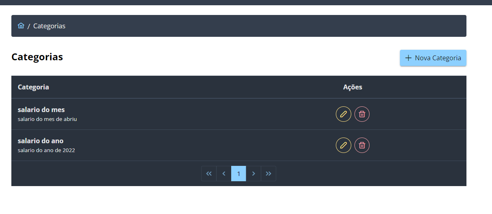
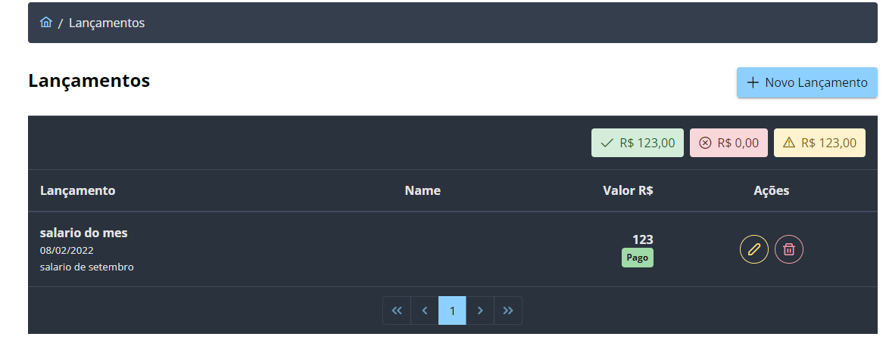

# TrilhaBack
Desafio 3

a) I. HTTP (Hypertext Transfer Protocol) é um protocolo de transferência de comunicação entre um navegador e um servidor web, sendo um dos principais da WWW (World Wide Web).

II. Rest é um protocolo para troca de mensagens (XML ou JSON) que podem usar HTTP para transportar como mensagens.

Web API é uma interface de programação de aplicações tanto para um servidor quanto para um navegador. III. Swagger é um framework para descrição, consumo e visualização de serviços Repousante, tendo como objetivo permitir que a documentação evolua na mesma necessidade que a implementação.

b) Obter - requisição por onde nós pedimos a representação de um recurso, por exemplo, html, xml, json e etc .; Pós - método utilizado quando desejamos criar um recurso; Put - método que requisita que um recurso seja guardado no URI previsto e se o recurso já existe o mesmo será atualizado; Excluir - exclui recursos associados; Trace - Devolve a mesma requisição que for enviada tanto se houver mudança e também se houver adição feita por servidores intermediários; Opções - retorna os métodos HTTP permitidos pelo servidor para um URL; Patch - usado para editar o recurso sem necessidade e enviar todos os atributos

Desafio 9

a)	Design Patterns (Padrões de Projetos) são soluções para problemas comuns encontrados no desenvolvimento ou na manutenção

de softwares orientação a objeto.

b)	Padrões de criação: Abstract Factory – Permite elaborar uma interface para criação de famílias de objetos relacionados ou interdependentes, que não especifica suas classes concretas. A partir desse padrão é possível criar fabricas concretas, que são responsáveis pela criação de novos objetos para entender as necessidades dos clientes. Portanto, essa prática ajuda a excluir a dependência entre o cliente e a classe dos objetos usados por ele.

Padrões estruturais: Adapter – A ação desse padrão é converter a interface de uma classe em outra, esperada pelo objeto cliente. Através dessa conversão será permitido que classes com imcompatibilidade de interfaces, consigam serem adaptadas para que outros objetos possam trabalhar juntos.

Padrões comportamentais: Chain of Responsability – Esse padrão encadeia vários objetos receptores que transporta uma solicitação, sendo aguardada até que um dos objetos responda. Com isso, se evita o acoplamento entre o remetente de uma solicitação e seu destinatário, dando oportunidade para mais de um objeto tratar a solicitação.

c)	Arquitetura de software define a forma como um sistema trabalha e como os novos módulos podem ser construídos e de forma intuitiva.

d)	Estamos seguindo a lógica de negócio, pois 

g) SOLID é um acrônimo dos cinco primeiros princípios da programação orientação a objetos e design de códigos identificados por Robert C. Martin nos anos 2000 que tem como significado: 

S – SRP (Princípio da Responsabilidade Única) – Uma classe deve ter um e somente um motivo para mudar.

O: OCP (Princípio Aberto-Fechado) – Você deve ser capaz de estender um comportamento de uma classe sem modificá-lo.

L: LSP (Princípio da Substituição de Liskov) – As classes base devem ser substituíveis por suas classes derivadas.

I: ISP (Princípio de Segregação de Interface) – Muitas interfaces especificas são melhores do que uma interface única

D: DIP (Princípio de inversão da dependência) – Dependa de uma abstração e não de uma implementação.

h) Foi utilizado até o momento o OCP(Open/Closed principle), LSP(Liskov Substitution Principle), ISP(Interface Segregation Principle)

O que é DDD?

  O Domain Driven Design combina práticas de design e desenvolvimento, oferecendo ferramentas de modelagem

  estratégica e tática para entregar um software de alta qualidade. Tem como objetivo acelerar o desenvolvimento de

  software que lidam com complexos processos de négocios.

Por que os padrões são divididos entre criação, estruturais e comportamentais?

  Existem vários tipos de padrões de projetos, sendo assim, para ter uma melhor organização e facilitar o programador, foi divididos em

  3 grandes categorias sendo os de criação, estrututais e comportametais. Todos os padrões destas categorias tem um conjunto de 

  características específicas, que motivam a categorização deles.

Desafio 11

a)Lib(ou biblioteca) é um conjunto de funcionalidades que podem ser reaproveitadas pelos seus projetos.

b)Clojure - uma linguagem de programação que combina a flexibilidade e facilidade de uma linguagem de script com a robustez do Java;

Apache Log4j – ele fornece uma excelente estrutura para produzir logs coerentes para aplicativos.

c)O Maven é uma ferramenta de integração de projetos, tendo como objetivo gerenciar dependências, 

controlar versões de artefatos, gerar relatórios de produtividade, garantir execução de testes,

manter nível de qualidade do código e entre outros.

d)O Maven é uma ferramenta de gerenciamento e compreensão de projetos de software usada principalmente 

em projetos Java, já o Gadle é um sistema de automação de códigos abertos baseado nos conceitos do Apache Ant e do Apache Maven.

e) I. Driver em Java são classes de utilitário usadas para realizar tarefas, essas classes são usadas em JDBC para 

conectar um aplicativo Java a um banco de dados.

   II. As bibliotecas são adicionadas no Pom.xml quando adicionamos as dependências e suas versões, com isso o Maven 

baixa essas bibliotecas e assim sendo possível sua utilização no projeto.

  III.Para realizar a conexão ao banco de dados SQL Server em um projeto Java, é necessário utilizar um driver JDBC 

adequado com uma rotina de programação. Com o SQL Server existem dois drivers, o oficial da Microsoft e o opensource jTDS. Para o driver da Microsoft

deve se seguir adicionar na classe Java ou no arquivo JSP a seguinte rotina:

String usuario = "exemplo";

String senha = "123456";

String url = "jdbc:sqlserver://sql.locadados.com.br:1433;databaseName=hsegura_tutorial" +

                       ";user=" + usuario + ";password=" + senha + ";";

try {

    Class.forName("com.microsoft.sqlserver.jdbc.SQLServerDriver");

    Connection conexao = DriverManager.getConnection(url);

} catch (ClassNotFoundException e) {

    // Erro caso o driver JDBC não foi instalado

    e.printStackTrace();

} catch (SQLException e) {

    // Erro caso haja problemas para se conectar ao banco de dados

    e.printStackTrace();

}

Já para o driver jTDS é feito da seguinte maneira:

String url = "jdbc:jtds:sqlserver://sql.locadados.com.br:1433/hsegura_tutorial";

String usuario = "exemplo";

String senha = "123456";

try {

Class.forName("net.sourceforge.jtds.jdbc.Driver");

Connection conexao = DriverManager.getConnection(url, usuario, senha);

} catch (ClassNotFoundException e) {

// Erro caso o driver JDBC não foi instalado

e.printStackTrace();

} catch (SQLException e) {

// Erro caso haja problemas para se conectar ao banco de dados

e.printStackTrace();
}

Desafio 12

a) O teste unitário ou de unidade é uma modalidade de testes que se concentra

na verificação da menor unidade do projeto de software. É realizado o teste de uma 

unidade lógica, com uso de dados suficientes para se testar apenas a lógica da unidade 

em questão.

b) Criar uma classe teste que estenda junit.framework.TestCase, depois as classes com regra de 

negocio, dentro da classe teste é de boa pratica colocar como nome dos metodos de 

teste facilitando o entendimento do código.

Verificar se o teste só tenha sucesso porque o código esta correto e para o teste der falha

somente se o cogigo testado estiver incorreto.

Também é de boa pratica criar mensagens curtas e de facil compreensão.

É colocado a anotação @SpringBootTest para iniciar o código para o teste e como isso podera ser

usado a @Autowire em qualquer bean selecionada pela varredura de componentes no teste.

c) O intuito de realizar teste unitario é previnir contra o aparecimento de bug´s vindo de

um código mau estrito, poder realizar alterações, verificar se tem falha

d) Bibliotecas de Mock e Runners

Desafio 13

Desafio 14

Desafio 1 

I.	Quando duas ou mais pessoas desenvolvem em uma branch e querem unificar as modificações antes do merge e quando você termina o desenvolvimento em uma branch e é necessário fazer um merge com a main.
II.	O commit é utilizado para criação do status do projeto.
III.	Git add- all: adiciona os arquivos na área de preparação e os deixa preparado para o commit e indica ao git que esses arquivos serão rastreados; git add –u: adiciona arquivos onde já existe uma entrada anterior; git add –A: adiciona todos os arquivos de todas as branches; git add. : adiciona todos os arquivos novos ou modificados.
IV.	git init / git status / git add . / git commit -m “mensagem” / git push -u origin main.
V.	Sim

Desafio 2 

I.	Uma entity é um objeto leve de domínio persistente utilizado para representar uma tabela as base de dados, sendo que cada instancia da entity corresponde uma linha da tabela.
II.	POO facilita a reutilização de objetos em outros programas, não precisando criar o código do zero e pode usar um objeto ou método já existente, podendo altera-lo para se adequar ao programa.
III.	Os getters e setters são sempre usados quando queremos encapsular em classe, ou seja, os atributos dessa classe só poderão ser acessados por outra classe através desses métodos.
IV.	Construtores são basicamente funções de inicialização de uma classe, as quais são invocadas no momento em que os objetos desta classe são criadas, permitindo inicializar campos internos da classe e alocar recursos que um objeto da classe pode declarar.
V.	No desafio 2 foi adquirido o conhecimento básico de POO e na criação de Entidade;
VI.	Sim 

Desafio 3

I.	A camada controller é responsável por intermediar as requisições enviadas pelo View com as respostas fornecidas pelo Model, processando os dados que o usuário informou e repassando para outras camadas.
II.	O REST ignora os detalhes da implementação de componentes e a sintaxe de protocolo com o objetivo de focar nos papeis dos componentes, nas restrições sobre sua interação com outros componentes e na sua interpretação de elementos de dados significantes.
III.	Os métodos para fazer um CRUD são: GET, POST, PUT e DELETE.
IV.	O @PathVarible é utilizado quando  o valor da variável é passada diretamente na URL, mas não como um parâmetro que você passa após o sinal de interrogação usado nos métodos DELETE e GET, o @PathParam é utilizado para pegar um parâmetro sendo usado para o método GET e o @RequestBody é usado principalmente para salvar objetos, sendo usado para os métodos PUT e POST.
V.	ResponseEntity representa uma resposta HTTP, incluindo cabeçalhos, corpos e status em uma API Spring Restful, a classe ResponseEntity estende HttpEntity.
VI.	Sim 
Desafio 4

I.	O padrão de projeto Repository acrescenta uma camada de abstração no topo da camada de consulta e ajuda a eliminar logica duplicada na implementação do código de suas consultas ao modelo de entidades.
II.	No Spring, para marcar os pontos de injeção dentro de uma classe, como quando vamos fazer a injeção do Repository se utiliza a anotação @Autowired.
III.	As facilidades de se usar o JPA são de conversão de registros de banco de dados em objetos Java; não precisa criar códigos SQL para salvar, alterar ou remover registros do banco de dados; a aplicação não fica presa a um banco de dados sendo simples a troca.
IV.	Criar uma classe de configuração passando login, senha e porta de conexão; e injetar a dependência do banco de dados escolhido.
V.	Sim.
Desafio 5

I.	A camada Service é onde fica a lógica da aplicação que o usuário não possui acesso, responsável pelas regras de negocio, persistência do manco de dados e as classes de entidades, se comunicando com as requisições da classe controller.
II.	Por conta do conceito do SOLID.
III.	O método void serve para dizer que não tem um retorno, já um método tipado retornara um valor conforme o método solicita. 
IV.	Services podem interagir com outros services.
V.	Sim. 
Desafio 6

I.	O padrão DTO serve de forma de segurança do programa, deixando apenas o necessário que o usuário pode ver.
II.	Construtores sempre possuem o mesmo nome da classe e nunca um tipo de retorno, já os getters e setters servem para o encapsulamento e integração dos dados.
III.	O Mapper nos auxilia em maperar modelos complexos, com nenhuma ou poucas configurações.
IV.	Sim.
Desafio 7 

Enum é uma palavra reservada que significa enumeração, serve para definir um conjunto de constantes de enumeração. Constantes enum são implicitamente static e final e você não pode mudar o valor, uma vez criado.
-Adicionar a dependência no arquivo pom.xml - <dependency> <groupId>org.hibernate</groupId> <artifactId>hibernate-validator</artifactId> <version>6.0.10.Final</version> </dependency>
Criar uma validados personalizado envolvendo uma lógica com if/else
Adicionar a anotação na classe que vai ser validado e por ultimo adicionar o exceptionHandler para lançar a mensagem personalizada.
Podemos usar os métodos Stream para executar varias tarefas que antes precisava de muitos códigos e que poderiam ser escritas de maneiras distintas. O for each é apenas uma operação final que nada é mais feito.
Sim.

Desafio 8

I.	Exceção são todos os erros que ocorrem durante o processamento de um método e podem ser esperados ou não. São falhas que idealmente não devem ocorrer no fluxo do sistema.
II.	Quando ocorre um erro ou exceção, o console apresenta uma mensagem avisando o ocorrido.
III.	Utilizando o laço throws para a exceção escolhida
IV.	Criar um pacote exclusiva para o tratamento e controle das exceções 
V.	Sim. 

Desafio 9

I.	Desing Patterns são soluções generalistas para problemas recorrentes durante o desenvolvimento de um software, não se trata de um framework ou código pronto, mas de uma definição de alto nível de como um problema comum pode ser solucionado.
II.	O – o principio de inversão de dependência(DIP), módulos de alto nível não devem depender de módulos de baixo nível. Ambos devem depender de abstrações. 
III.	Tem como objetivo garantir a consistência e segurança da aplicação, pois é possível manipular os dados de forma pontual.
IV.	A arquitetura Hexagonal traz bastante beneficius, em grandes aplicações com a divisão em camadas, em aplicações muito complexar com o encapsulamento da logica, em aplicações com muitas integrações com utilização de interfaces e serviços, aumentando a facilidade de manutenção.
V.	Sim.
Desafio 10

I.	Java é uma linguagem de programação, enquanto Spring é uma estrutura de aplicação de código aberto. 
II.	Não, pois é necessário escolher qual framework de persistência ele vai se relacionar.
III.	Sim, com as dependências aplicadas no POM.xml e aplicando as anotações onde esses frameworks serão utilizados.
IV.	Sim.
Desafio 11

I.	JUnit – framework que assemelha ao raio de testes software Java;   ModelMapper – possível mapear modelos complexos, com nenhuma ou poucas                 configurações; Lombok – é um framework que permite escrever código eliminando a verbosidade, seu uso permite gerar em tempo de compilação os métodos getters e setters, métodos construtores, padrão builder e entre outros; Hibernate – framework para mapeamento objeto-relacional escrito na linguagem Java.
II.	Libs tem suas regras e métodos padronizados, já drivers retornam dados consultados em um formato relacional fornecendo conexão entre banco de dados por meio das interfaces JDBC.
III.	Não 
IV.	Uma ferramenta que facilita a vida do desenvolvedor e auxilia no gerenciamento das bibliotecas utilizadas no projeto.
V.	Sim. 
Desafio 12

I.	A metodologia DevOps tem a responsabilidade de manter a segurança da aplicação. A parte de desenvolvimento e teste é necessário para garantir que o software esteja em bom estado antes de subir o projeto.
II.	Mockito é um framework de Test e Spy e tem como objetivo similar a instancia de classes e comportamento de métodos.
III.	Sonar é um projeto open source que visa justamente avaliar a qualidade de seu código. 
IV.	Sim.
Desafio 13

I.	O processo foi tranquilo, apenas sendo necessário modificar o caminho HTTP igual ao back end. Foi necessário a instalação do Node.Js 
II.	A única dificuldade apresentada foi em verificar a comunicação da variável do back se comunicando o front e adequar o mesmo.
III.	Sim
IV.	CORS é um mecanismo utilizado pelos navegadores para compartilhar recursos ente diferentes origens. O CORS é uma especificação do W3C e faz uso de headers do HTTP para informar aos navegadores se determinado recurso pode ser ou não acessado.
V.	Sim.

